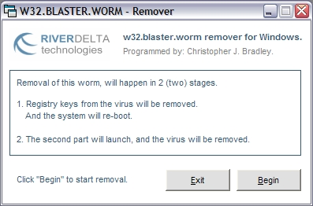



## w32\.blaster\.worm \(A,B & C\) remover \(updated\)

### Description

This is just a minor update to my previous submission for the DCOM worm remover. This simple update will remove the BLASTER worm, as well as it's B and C varients.
 
### More Info
 

             |
---                |---
**Submitted On**   |2003-08-15 14:57:48
**By**             |[Chris Blaker](https://github.com/Planet-Source-Code/PSCIndex/blob/master/ByAuthor/chris-blaker.md)
**Level**          |Intermediate
**User Rating**    |5.0 (20 globes from 4 users)
**Compatibility**  |VB 6\.0
**Category**       |[Miscellaneous](https://github.com/Planet-Source-Code/PSCIndex/blob/master/ByCategory/miscellaneous__1-1.md)
**World**          |[Visual Basic](https://github.com/Planet-Source-Code/PSCIndex/blob/master/ByWorld/visual-basic.md)
**Archive File**   |[w32\_blaste1630418152003\.zip](https://github.com/Planet-Source-Code/chris-blaker-w32-blaster-worm-a-b-c-remover-updated__1-47741/archive/master.zip)

